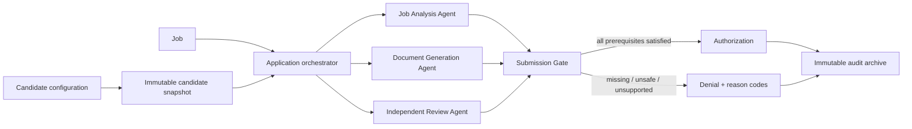

<div align="center">

# CareerOS

### A safety-gated AI application platform with explicit workflows, evidence-backed generation, and auditable decisions.


</div>

## Why this project exists

Most "AI job application" demos stop at generating text. CareerOS explores the harder engineering problem around that generation: **candidate configuration, deterministic policy checks, workflow state, evidence traceability, persistence, independent review, and auditability**.

The current milestone is deliberately conservative. It uses fictional candidate data and does **not** perform live browser submission, CAPTCHA handling, anti-bot bypasses, or ATS manipulation.

## System at a glance



The key design choice is that the AI workers can **propose**, but they cannot authorize submission. That decision belongs to a deterministic `SubmissionGate` that fails closed when a prerequisite is absent or invalid.

## Core engineering ideas

### Candidate configuration as data

Candidate-specific facts and policies live outside the engine. Profiles are schema-validated, versioned, and converted into deterministic snapshots with source hashes for later auditing.

### Evidence-backed generation

Generated claims are expected to point back to explicit candidate evidence instead of relying on hidden mutable memory.

### Explicit application workflow

Applications move through an enum-backed allow-listed state machine. Transition commands are idempotent and invalid transitions fail explicitly.

### Independent review

Generation and semantic review are separated. The reviewer receives a complete request rather than sharing mutable conversational context with the generator.

### Fail-closed submission control

Only the deterministic gate can issue an authorization. Missing values, incomplete evidence, failed reviews, legal-status problems, unresolved security events, or invalid workflow state result in denial.

### Immutable audit trail

Application archives contain canonical snapshots and a manifest with hashes so later modification can be detected.

## Stack

| Layer | Technology |
| --- | --- |
| Backend API | FastAPI, Pydantic v2 |
| Persistence | PostgreSQL, SQLAlchemy 2, Alembic |
| Coordination boundary | Redis |
| Frontend | Next.js, React, TypeScript |
| Deployment | Docker Compose |
| Validation / tests | Pytest + frontend lint/typecheck/test/build gates |

## Repository structure

```text
.
├── app/                    # Backend domain + API implementation
├── frontend/               # Next.js control plane
├── candidates/             # Fictional candidate configurations
├── migrations/             # Alembic schema migrations
├── docs/                   # Architecture documentation
├── tests/                  # Backend tests
├── docker-compose.yml      # Full local stack
├── pyproject.toml
└── README.md
```

For the detailed trust boundaries and design rationale, see [`docs/ARCHITECTURE.md`](./docs/ARCHITECTURE.md).

## Run the full stack

```bash
docker compose up --build
```

Then open:

- Web control plane: `http://localhost:3000`
- API: `http://localhost:8000`
- OpenAPI docs: `http://localhost:8000/docs`

Compose starts the frontend, API, PostgreSQL, and Redis and applies Alembic migrations before serving the backend.

## Local backend setup

```bash
python -m venv .venv
.venv/Scripts/pip install -e ".[dev]"
python -m app validate-candidate --candidate example_candidate
python -m app readiness --candidate example_candidate
pytest
```

On Linux/macOS, activate the environment with `source .venv/bin/activate` and use `.venv/bin/pip` as usual.

## Frontend development

```bash
cd frontend
npm install
npm run dev
npm run lint
npm run typecheck
npm test
npm run build
```

## Scope and limitations

This repository is an engineering foundation, not a production auto-application bot. The current milestone intentionally excludes:

- live application submission;
- browser automation / Playwright submission;
- CAPTCHA handling or anti-bot workarounds;
- ATS manipulation;
- real candidate data in the repository.

That boundary is part of the architecture rather than an unfinished shortcut: the project is designed so future execution components cannot silently bypass evidence, review, authorization, or audit controls.

---

<sub>Built as an exploration of how AI agents can be embedded inside deterministic, inspectable software systems rather than treated as the system itself.</sub>
